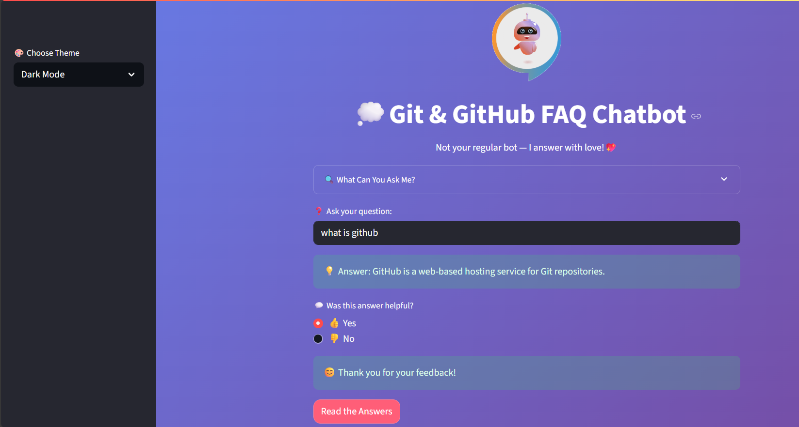

# 💬 Git & GitHub FAQ Chatbot  
A simple AI-powered chatbot to answer your Git & GitHub questions — with style!  


## 📖 About the Project  

- 🔹 An interactive FAQ Chatbot built with *Streamlit*  
- 🔹 Answers common *Git & GitHub questions* instantly  
- 🔹 Includes *Theme Toggle, **User Feedback Buttons, and **Text-to-Speech*  
- 🔹 Designed with a clean interface and expandable FAQ viewer  

---

## ✨ Features  

- ✅ Real-time Question Answering  
- ✅ View all FAQs in an expandable list  
- ✅ User Feedback (Was this helpful?)  
- ✅ Theme Toggle (Light/Dark Mode)  
- ✅ Text-to-Speech for Answer Reading  
- ✅ Stylish UI with Anime-inspired header  


## 🖼 Demo Preview  

  

---

## 🛠 Built With  

- 🐍 Python  
- 🎨 Streamlit  
- 🎤 pyttsx3 (Text-to-Speech)  

---

## 📝 How to Use  

```bash
git clone https://github.com/KripaSharma09/CodeAlpha_Projects.git
cd CodeAlpha_Projects/Task_2_FAQ_Chatbot/
pip install -r requirements.txt
streamlit run app.py
